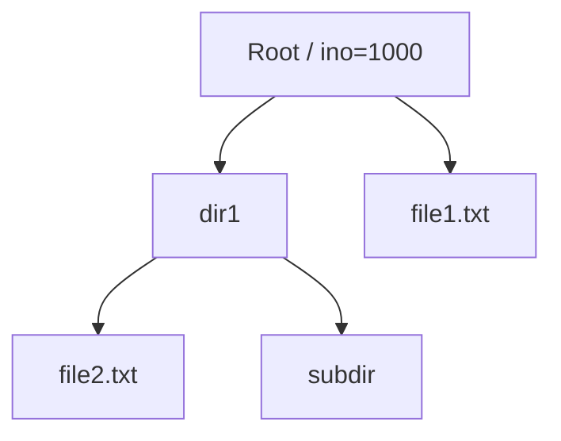

# Архитектурная документация VTFS

## Требования к реализации (из README.md)

VTFS - виртуальная файловая система как модуль ядра Linux:
- Хранение данных в RAM (Часть 6) или на удаленном HTTP-сервере (Часть 10).
- Поддержка базовых операций: монтирование (`mount -t vtfs`), навигация (`ls`, `cd`), создание/удаление файлов/директорий (`touch`, `mkdir`, `rm`, `rmdir`).
- Чтение/запись файлов (`cat`, `echo >`).
- Жесткие ссылки на файлы (`ln`), но не на директории.
- Права доступа: упрощенные (777).
- Файлы содержат ASCII 0-127.
- Сервер: HTTP API (list, create, ...), клиент в `vtfs_http_call`.
- Токен для монтирования.

**Этапы реализации:**
- Базовая ФС (Части 1-5): заглушки.
- RAM-хранилище (Часть 6).
- Директории (Часть 7).
- R/W (Часть 8*).
- Ссылки (Часть 9*).
- HTTP-сервер (Часть 10).

## Спецификации системных вызовов (VFS интерфейс)

VTFS реализует ключевые структуры VFS:

### file_system_type
```c
struct file_system_type vtfs_fs_type = {
    .name = \"vtfs\",
    .mount = vtfs_mount,  // -> mount_nodev -> vtfs_fill_super
    .kill_sb = vtfs_kill_sb
};
```

### inode_operations (vtfs_inode_ops)
- `.lookup`: поиск entry по имени в parent.
- `.create`: создание файла.
- `.unlink`: удаление файла.
- `.mkdir`: создание директории.
- `.rmdir`: удаление пустой директории.
- `.link`: жесткая ссылка (увеличить nlink).

### file_operations
- Директории (vtfs_dir_ops): `.iterate` (readdir).
- Файлы (vtfs_file_ops): `.read`, `.write`.

### super_operations (опционально): alloc_inode, destroy_inode.

## Структура inodes

Стандартная Linux [`inode`](include/linux/fs.h) + расширения:
- `i_ino`: уникальный номер (GLOB_INODE_COUNTER++).
- `i_mode`: S_IFREG/S_IFDIR | права (S_IRWXUGO).
- `i_size`: размер данных.
- `i_private`: указатель на `vtfs_entry`.
- `i_op = &vtfs_inode_ops`.
- `i_fop`: &vtfs_dir_ops или &vtfs_file_ops.

### vtfs_entry (fs.h)
```c
struct vtfs_entry {
    char name[MAX_NAME_LEN];
    umode_t mode;
    ino_t ino;
    struct list_head list;  // для children в директории
    struct vtfs_entry *parent;  // для иерархии
    struct list_head children;  // список подчиненных
    char *data;  // данные файла (RAM)
    size_t size;
    atomic_t refcount;  // для hard links (i_nlink)
};
```

```mermaid
classDiagram
    class inode {
        +ino_t i_ino
        +umode_t i_mode
        +loff_t i_size
        +void* i_private
        +struct inode_operations* i_op
        +struct file_operations* i_fop
    }
    class vtfs_entry {
        +char name[MAX_NAME_LEN]
        +umode_t mode
        +ino_t ino
        +struct list_head list
        +vtfs_entry* parent
        +struct list_head children
        +char* data
        +size_t size
        +atomic_t refcount
    }
    inode ||--|| vtfs_entry : i_private
    vtfs_entry ||--o{ vtfs_entry : parent/children
```

### super_block.s_fs_info -> vtfs_sb_info
```c
struct vtfs_sb_info {
    struct vtfs_entry *root_entry;
    struct list_head all_entries;  // optional для GC
};
```

## Управление блоками данных

### RAM-реализация (текущая/Часть 6)
- Single-block: `vtfs_entry->data` (kmalloc/realloc при write).
- Нет настоящих блоков: данные целиком в памяти.
- `read/write`: copy_to_user/from_user с проверкой offset/size.

### HTTP-реализация (Часть 10)
- `vtfs_http_call(token, method, ...)`: list, create, read, write, delete, ...
- Методы: list(path), get(path), put(path, data), delete(path), mkdir(path), etc.
- Сервер: любой язык + БД (PostgreSQL/YDB).
- Кэширование? Опционально в RAM.

Переход: абстрагировать ops через интерфейс (struct vtfs_backend_ops { list(), create(), ... }).

## Иерархия каталогов

**Текущая проблема:** flat list в `sbi->entries` (все файлы/диры в root).

**Предлагаемая:** Tree структура.
- Root: i_ino=1000, vtfs_entry с children list.
- lookup: поиск в parent->children.
- mkdir: new vtfs_entry(S_IFDIR), add to parent->children.
- iterate: traverse parent->children, dir_emit(name, ino, DT_DIR/REG).
- Путь: полный path parsing в lookup (рекурсивно? или dcache handles).



## Корректное удаление файлов (особое внимание)

**Проблемы в user space (`rm`):**
- unlink() syscall -> vfs_unlink -> inode_ops->unlink.
- Для hard links: удалять только если i_nlink == 1 после --.
- Директории: rmdir только если empty (no children).
- Данные: free(data) только при destroy_inode (refcount==0).
- RAM leaks: kfree(data), del_from lists.

### Workflow удаления файла
```mermaid
flowchart TD
    A[rm file.txt] --> B[vfs_unlink: parent, dentry]
    B --> C[vtfs_unlink: find entry by name in parent->children]
    C --> D[entry->refcount-- или i_nlink--]
    D --> E{i_nlink > 1?}
    E -->|Да| F[Только remove from parent->children<br/>return 0]
    E -->|Нет| G[remove from parent->children<br/>free(entry->data)<br/>destroy_inode]
    G --> H[list_del, kfree(entry)]
    F --> I[Done]
    H --> I
```

**Ключевые моменты:**
1. **Refcount:** inode->i_nlink (VFS tracks), sync с entry->refcount.
2. **unlink vs destroy:** unlink removes dentry link, destroy_inode frees inode/data когда refs==0.
3. **Для директорий:** rmdir checks list_empty(&entry->children).
4. **Hard links:** ln increments i_nlink, unlink decrements.
5. **User space корректность:** `rm file` succeeds если exists, `rm non-empty dir` fails ENOTEMPTY.
6. **HTTP:** DELETE request, но только если no links.

**Текущий код:** Нет unlink, flat list, no refcount/tree - нужно доработать.

## Рекомендации по реализации
- Добавить parent/children в vtfs_entry.
- Реализовать недостающие ops: iterate, unlink, mkdir, rmdir, read, write, link.
- Backend абстракция для RAM/HTTP.
- super_operations для inode lifecycle.

Документация готова для review. Следующие шаги: имплементация в code mode.